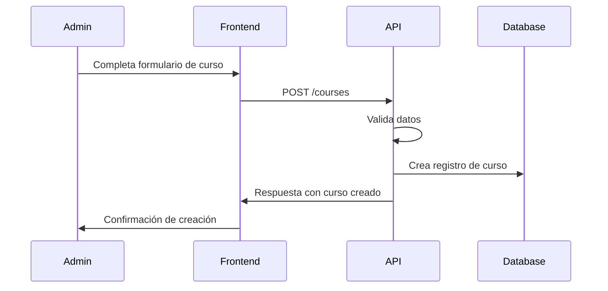
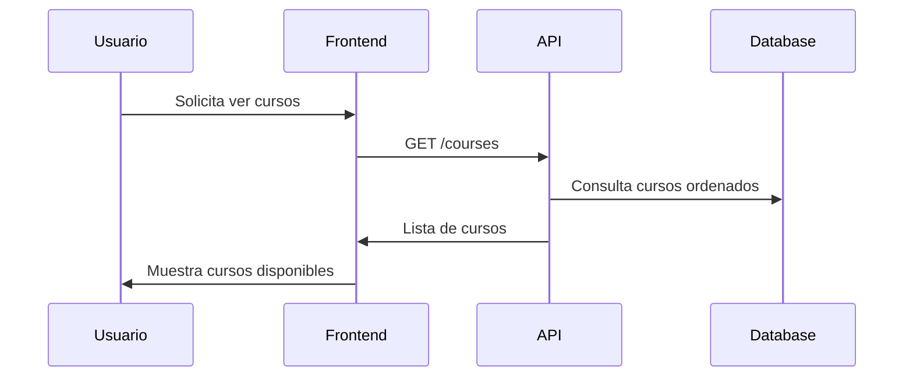
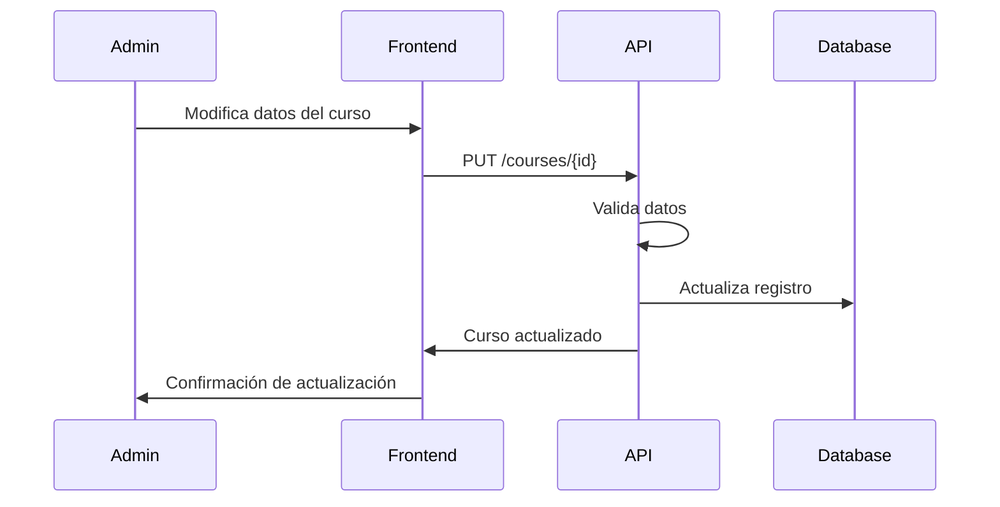

# Sistema de Gestión de Cursos - API RIMANAQ

## Tabla de Contenidos

1. [Descripción General](#descripción-general)
2. [Arquitectura](#arquitectura)
3. [Endpoints de Cursos](#endpoints-de-cursos)
4. [Modelo de Datos](#modelo-de-datos)
5. [Validaciones](#validaciones)
6. [Códigos de Respuesta](#códigos-de-respuesta)
7. [Ejemplos de Uso](#ejemplos-de-uso)
8. [Casos de Uso](#casos-de-uso)
9. [Manejo de Errores](#manejo-de-errores)
10. [Guías de Implementación](#guías-de-implementación)

---

## Descripción General

El sistema de gestión de cursos permite crear, leer, actualizar y eliminar cursos en la plataforma RIMANAQ. Cada curso puede contener múltiples lecciones y tiene asociado un progreso por usuario.

### Características Principales
- ✅ CRUD completo de cursos (Create, Read, Update, Delete)
- ✅ Listado de cursos con ordenamiento
- ✅ Validación robusta de datos
- ✅ Manejo de imágenes y colores personalizados
- ✅ Relaciones con lecciones y progreso
- ✅ Respuestas consistentes en JSON
- ✅ Manejo de errores detallado

---

## Arquitectura

```
┌─────────────────┐    ┌──────────────────┐    ┌─────────────────┐
│   Frontend      │────│   API Routes     │────│ CourseController│
│   (Cliente)     │    │ (/api/courses)   │    │                 │
└─────────────────┘    └──────────────────┘    └─────────────────┘
                                │                        │
                                │                        │
                       ┌──────────────────┐    ┌─────────────────┐
                       │   Validaciones   │    │  Course Model   │
                       │   (Controller)   │    │   (Eloquent)    │
                       └──────────────────┘    └─────────────────┘
                                │                        │
                                │                        │
                       ┌──────────────────┐    ┌─────────────────┐
                       │   Middleware     │    │  MySQL Database │
                       │ (auth:sanctum)   │    │  (Persistencia) │
                       └──────────────────┘    └─────────────────┘
```

---

## Endpoints de Cursos

### Base URL
```
http://localhost:8000/api
```

**Nota:** Todos los endpoints de cursos requieren autenticación con Laravel Sanctum.

### 1. Listar Todos los Cursos

**Endpoint:** `GET /courses`

**Descripción:** Obtiene todos los cursos ordenados por fecha de creación (más recientes primero).

**Headers:**
```http
Accept: application/json
Authorization: Bearer {token}
```

**Respuesta Exitosa (200):**
```json
{
    "success": true,
    "data": [
        {
            "id": 1,
            "name": "Curso de Lengua de Señas Básico",
            "description": "Aprende los fundamentos de la lengua de señas",
            "image_path": "courses/curso-basico.jpg",
            "color": "#3B82F6",
            "created_at": "2025-10-02T10:30:00.000000Z",
            "updated_at": "2025-10-02T10:30:00.000000Z"
        },
        {
            "id": 2,
            "name": "Curso Intermedio de Señas",
            "description": "Desarrolla habilidades intermedias en lengua de señas",
            "image_path": "courses/curso-intermedio.jpg",
            "color": "#10B981",
            "created_at": "2025-10-01T15:20:00.000000Z",
            "updated_at": "2025-10-01T15:20:00.000000Z"
        }
    ],
    "message": "Cursos obtenidos exitosamente"
}
```

### 2. Obtener Curso Específico

**Endpoint:** `GET /courses/{id}`

**Descripción:** Obtiene un curso específico por su ID.

**Headers:**
```http
Accept: application/json
Authorization: Bearer {token}
```

**Parámetros de Ruta:**
| Campo | Tipo | Descripción |
|-------|------|-------------|
| `id` | integer | ID único del curso |

**Respuesta Exitosa (200):**
```json
{
    "success": true,
    "data": {
        "id": 1,
        "name": "Curso de Lengua de Señas Básico",
        "description": "Aprende los fundamentos de la lengua de señas",
        "image_path": "courses/curso-basico.jpg",
        "color": "#3B82F6",
        "created_at": "2025-10-02T10:30:00.000000Z",
        "updated_at": "2025-10-02T10:30:00.000000Z"
    },
    "message": "Curso obtenido exitosamente"
}
```

### 3. Crear Nuevo Curso

**Endpoint:** `POST /courses`

**Descripción:** Crea un nuevo curso en el sistema.

**Headers:**
```http
Content-Type: application/json
Accept: application/json
Authorization: Bearer {token}
```

**Parámetros del Body:**
| Campo | Tipo | Requerido | Descripción |
|-------|------|-----------|-------------|
| `name` | string | Sí | Nombre del curso (máx. 255 caracteres) |
| `description` | string | Sí | Descripción detallada del curso |
| `image_path` | string | No | Ruta de la imagen del curso (máx. 255 caracteres) |
| `color` | string | No | Color en formato hexadecimal (#RRGGBB) |

**Ejemplo de Request:**
```json
{
    "name": "Curso Avanzado de Lengua de Señas",
    "description": "Curso para perfeccionar las habilidades en lengua de señas con vocabulario avanzado",
    "image_path": "courses/curso-avanzado.jpg",
    "color": "#EF4444"
}
```

**Respuesta Exitosa (201):**
```json
{
    "success": true,
    "data": {
        "id": 3,
        "name": "Curso Avanzado de Lengua de Señas",
        "description": "Curso para perfeccionar las habilidades en lengua de señas con vocabulario avanzado",
        "image_path": "courses/curso-avanzado.jpg",
        "color": "#EF4444",
        "created_at": "2025-10-02T14:25:00.000000Z",
        "updated_at": "2025-10-02T14:25:00.000000Z"
    },
    "message": "Curso creado exitosamente"
}
```

### 4. Actualizar Curso

**Endpoint:** `PUT /courses/{id}`

**Descripción:** Actualiza un curso existente.

**Headers:**
```http
Content-Type: application/json
Accept: application/json
Authorization: Bearer {token}
```

**Parámetros de Ruta:**
| Campo | Tipo | Descripción |
|-------|------|-------------|
| `id` | integer | ID único del curso a actualizar |

**Parámetros del Body:** (Mismos que en la creación)
| Campo | Tipo | Requerido | Descripción |
|-------|------|-----------|-------------|
| `name` | string | Sí | Nombre del curso (máx. 255 caracteres) |
| `description` | string | Sí | Descripción detallada del curso |
| `image_path` | string | No | Ruta de la imagen del curso (máx. 255 caracteres) |
| `color` | string | No | Color en formato hexadecimal (#RRGGBB) |

**Respuesta Exitosa (200):**
```json
{
    "success": true,
    "data": {
        "id": 3,
        "name": "Curso Avanzado de Lengua de Señas - Actualizado",
        "description": "Curso actualizado para perfeccionar las habilidades en lengua de señas",
        "image_path": "courses/curso-avanzado-v2.jpg",
        "color": "#8B5CF6",
        "created_at": "2025-10-02T14:25:00.000000Z",
        "updated_at": "2025-10-02T16:15:00.000000Z"
    },
    "message": "Curso actualizado exitosamente"
}
```

### 5. Eliminar Curso

**Endpoint:** `DELETE /courses/{id}`

**Descripción:** Elimina un curso del sistema.

**Headers:**
```http
Accept: application/json
Authorization: Bearer {token}
```

**Parámetros de Ruta:**
| Campo | Tipo | Descripción |
|-------|------|-------------|
| `id` | integer | ID único del curso a eliminar |

**Respuesta Exitosa (200):**
```json
{
    "success": true,
    "message": "Curso eliminado exitosamente"
}
```

---

## Modelo de Datos

### Modelo Course

**Tabla:** `courses`

| Campo | Tipo | Descripción | Restricciones |
|-------|------|-------------|---------------|
| `id` | bigint | Identificador único (autoincremental) | PRIMARY KEY, NOT NULL |
| `name` | varchar(255) | Nombre del curso | NOT NULL |
| `description` | text | Descripción del curso | NULLABLE |
| `image_path` | varchar(255) | Ruta de la imagen | NULLABLE |
| `color` | varchar(7) | Color en formato hex | NULLABLE |
| `created_at` | timestamp | Fecha de creación | NULLABLE |
| `updated_at` | timestamp | Fecha de actualización | NULLABLE |

**Relaciones:**
- `hasMany(Lesson::class)` - Un curso puede tener múltiples lecciones
- `hasMany(Progress::class)` - Un curso puede tener múltiples registros de progreso

**Atributos Fillable:**
- `name`
- `description`
- `image_path`
- `color`

---

## Validaciones

### Crear/Actualizar Curso

| Campo | Reglas | Descripción |
|-------|--------|-------------|
| `name` | `required\|string\|max:255` | Nombre obligatorio, texto, máximo 255 caracteres |
| `description` | `required\|string` | Descripción obligatoria, texto sin límite específico |
| `image_path` | `nullable\|string\|max:255` | Ruta opcional, texto, máximo 255 caracteres |
| `color` | `nullable\|string\|max:7\|regex:/^#[0-9A-Fa-f]{6}$/` | Color opcional, formato hexadecimal válido |

### Ejemplos de Colores Válidos
- `#FF0000` - Rojo
- `#00FF00` - Verde  
- `#0000FF` - Azul
- `#3B82F6` - Azul Material
- `#EF4444` - Rojo Material

---

## Códigos de Respuesta

### Respuestas Exitosas

| Código | Descripción | Endpoint |
|--------|-------------|----------|
| `200` | OK - Operación exitosa | GET, PUT, DELETE |
| `201` | Created - Curso creado exitosamente | POST |

### Respuestas de Error

| Código | Descripción | Posibles Causas |
|--------|-------------|-----------------|
| `401` | Unauthorized | Token inválido o ausente |
| `404` | Not Found | Curso no encontrado |
| `422` | Unprocessable Entity | Errores de validación |
| `500` | Internal Server Error | Error interno del servidor |

---

## Ejemplos de Uso

### Obtener Todos los Cursos

```bash
curl -X GET http://localhost:8000/api/courses \
  -H "Accept: application/json" \
  -H "Authorization: Bearer {token}"
```

### Crear Nuevo Curso

```bash
curl -X POST http://localhost:8000/api/courses \
  -H "Content-Type: application/json" \
  -H "Accept: application/json" \
  -H "Authorization: Bearer {token}" \
  -d '{
    "name": "Curso de Números en Señas",
    "description": "Aprende a comunicar números usando lengua de señas",
    "image_path": "courses/numeros-senas.jpg",
    "color": "#F59E0B"
  }'
```

### Actualizar Curso

```bash
curl -X PUT http://localhost:8000/api/courses/1 \
  -H "Content-Type: application/json" \
  -H "Accept: application/json" \
  -H "Authorization: Bearer {token}" \
  -d '{
    "name": "Curso Básico Actualizado",
    "description": "Descripción actualizada del curso básico",
    "image_path": "courses/basico-v2.jpg",
    "color": "#10B981"
  }'
```

### Eliminar Curso

```bash
curl -X DELETE http://localhost:8000/api/courses/1 \
  -H "Accept: application/json" \
  -H "Authorization: Bearer {token}"
```

---

## Casos de Uso

### 1. Flujo de Creación de Curso



### 2. Flujo de Listado de Cursos



### 3. Flujo de Actualización de Curso



---

## Manejo de Errores

### Error de Validación (422)

```json
{
    "success": false,
    "message": "Datos de validación incorrectos",
    "errors": {
        "name": [
            "The name field is required."
        ],
        "color": [
            "The color field must match the format #RRGGBB."
        ]
    }
}
```

### Curso No Encontrado (404)

Laravel maneja automáticamente el error 404 cuando se usa model binding:

```json
{
    "message": "No query results for model [App\\Models\\Course] 1"
}
```

### Error del Servidor (500)

```json
{
    "success": false,
    "message": "Error al crear el curso",
    "error": "Descripción técnica del error"
}
```

### Error de Autenticación (401)

```json
{
    "message": "Unauthenticated."
}
```

---

## Guías de Implementación

### Para Frontend (JavaScript/Vue.js)

#### 1. Servicio de Cursos

```javascript
// courseService.js
import api from './api'; // Configurado con Sanctum

class CourseService {
    async getAllCourses() {
        try {
            const response = await api.get('/courses');
            return response.data;
        } catch (error) {
            throw this.handleError(error);
        }
    }

    async getCourse(id) {
        try {
            const response = await api.get(`/courses/${id}`);
            return response.data;
        } catch (error) {
            throw this.handleError(error);
        }
    }

    async createCourse(courseData) {
        try {
            const response = await api.post('/courses', courseData);
            return response.data;
        } catch (error) {
            throw this.handleError(error);
        }
    }

    async updateCourse(id, courseData) {
        try {
            const response = await api.put(`/courses/${id}`, courseData);
            return response.data;
        } catch (error) {
            throw this.handleError(error);
        }
    }

    async deleteCourse(id) {
        try {
            const response = await api.delete(`/courses/${id}`);
            return response.data;
        } catch (error) {
            throw this.handleError(error);
        }
    }

    handleError(error) {
        if (error.response?.data?.errors) {
            return {
                type: 'validation',
                errors: error.response.data.errors,
                message: error.response.data.message
            };
        } else if (error.response?.data?.message) {
            return {
                type: 'general',
                message: error.response.data.message
            };
        } else {
            return {
                type: 'network',
                message: 'Error de conexión. Inténtalo de nuevo.'
            };
        }
    }
}

export default new CourseService();
```

#### 2. Componente de Lista de Cursos (Vue.js)

```vue
<template>
  <div class="courses-list">
    <h2>Lista de Cursos</h2>
    
    <!-- Botón para crear curso -->
    <button @click="showCreateForm = true" class="create-btn">
      Crear Nuevo Curso
    </button>

    <!-- Loading -->
    <div v-if="loading" class="loading">
      Cargando cursos...
    </div>

    <!-- Error -->
    <div v-if="error" class="error">
      {{ error }}
    </div>

    <!-- Lista de cursos -->
    <div v-if="!loading && courses.length > 0" class="courses-grid">
      <div
        v-for="course in courses"
        :key="course.id"
        class="course-card"
        :style="{ borderColor: course.color }"
      >
        
        <div class="course-content">
          <h3>{{ course.name }}</h3>
          <p>{{ course.description }}</p>
          <div class="course-actions">
            <button @click="editCourse(course)" class="edit-btn">
              Editar
            </button>
            <button @click="deleteCourse(course.id)" class="delete-btn">
              Eliminar
            </button>
          </div>
        </div>
      </div>
    </div>

    <!-- Sin cursos -->
    <div v-if="!loading && courses.length === 0" class="no-courses">
      No hay cursos disponibles
    </div>

    <!-- Modal para crear/editar -->
    <CourseForm
      v-if="showCreateForm || editingCourse"
      :course="editingCourse"
      @save="handleSave"
      @cancel="handleCancel"
    />
  </div>
</template>

<script>
import CourseService from '@/services/courseService';
import CourseForm from './CourseForm.vue';

export default {
  name: 'CoursesList',
  components: {
    CourseForm
  },
  data() {
    return {
      courses: [],
      loading: false,
      error: null,
      showCreateForm: false,
      editingCourse: null
    };
  },
  async mounted() {
    await this.loadCourses();
  },
  methods: {
    async loadCourses() {
      this.loading = true;
      this.error = null;

      try {
        const response = await CourseService.getAllCourses();
        this.courses = response.data;
      } catch (error) {
        this.error = error.message;
      } finally {
        this.loading = false;
      }
    },

    editCourse(course) {
      this.editingCourse = { ...course };
      this.showCreateForm = false;
    },

    async deleteCourse(id) {
      if (!confirm('¿Estás seguro de que quieres eliminar este curso?')) {
        return;
      }

      try {
        await CourseService.deleteCourse(id);
        await this.loadCourses();
        this.$toast.success('Curso eliminado exitosamente');
      } catch (error) {
        this.$toast.error(error.message);
      }
    },

    async handleSave(courseData) {
      try {
        if (this.editingCourse) {
          await CourseService.updateCourse(this.editingCourse.id, courseData);
          this.$toast.success('Curso actualizado exitosamente');
        } else {
          await CourseService.createCourse(courseData);
          this.$toast.success('Curso creado exitosamente');
        }
        
        await this.loadCourses();
        this.handleCancel();
      } catch (error) {
        this.$toast.error(error.message);
      }
    },

    handleCancel() {
      this.showCreateForm = false;
      this.editingCourse = null;
    }
  }
};
</script>
```

#### 3. Componente de Formulario de Curso

```vue
<template>
  <div class="modal-overlay" @click="$emit('cancel')">
    <div class="modal" @click.stop>
      <h3>{{ course ? 'Editar Curso' : 'Crear Nuevo Curso' }}</h3>
      
      <form @submit.prevent="handleSubmit">
        <div class="form-group">
          <label for="name">Nombre del Curso *</label>
          <input
            id="name"
            v-model="form.name"
            type="text"
            required
            maxlength="255"
            :class="{ 'error': errors.name }"
          />
          <span v-if="errors.name" class="error-message">
            {{ errors.name[0] }}
          </span>
        </div>

        <div class="form-group">
          <label for="description">Descripción *</label>
          <textarea
            id="description"
            v-model="form.description"
            required
            rows="4"
            :class="{ 'error': errors.description }"
          ></textarea>
          <span v-if="errors.description" class="error-message">
            {{ errors.description[0] }}
          </span>
        </div>

        <div class="form-group">
          <label for="image_path">Ruta de Imagen</label>
          <input
            id="image_path"
            v-model="form.image_path"
            type="text"
            maxlength="255"
            placeholder="courses/mi-imagen.jpg"
            :class="{ 'error': errors.image_path }"
          />
          <span v-if="errors.image_path" class="error-message">
            {{ errors.image_path[0] }}
          </span>
        </div>

        <div class="form-group">
          <label for="color">Color del Curso</label>
          <input
            id="color"
            v-model="form.color"
            type="color"
            :class="{ 'error': errors.color }"
          />
          <input
            v-model="form.color"
            type="text"
            placeholder="#3B82F6"
            pattern="^#[0-9A-Fa-f]{6}$"
            maxlength="7"
            class="color-text"
          />
          <span v-if="errors.color" class="error-message">
            {{ errors.color[0] }}
          </span>
        </div>

        <div class="form-actions">
          <button type="button" @click="$emit('cancel')" class="cancel-btn">
            Cancelar
          </button>
          <button type="submit" :disabled="loading" class="save-btn">
            {{ loading ? 'Guardando...' : (course ? 'Actualizar' : 'Crear') }}
          </button>
        </div>
      </form>
    </div>
  </div>
</template>

<script>
export default {
  name: 'CourseForm',
  props: {
    course: {
      type: Object,
      default: null
    }
  },
  emits: ['save', 'cancel'],
  data() {
    return {
      form: {
        name: '',
        description: '',
        image_path: '',
        color: '#3B82F6'
      },
      errors: {},
      loading: false
    };
  },
  mounted() {
    if (this.course) {
      this.form = { ...this.course };
    }
  },
  methods: {
    async handleSubmit() {
      this.loading = true;
      this.errors = {};

      try {
        // Limpiar campos vacíos opcionales
        const formData = { ...this.form };
        if (!formData.image_path) delete formData.image_path;
        if (!formData.color) delete formData.color;

        this.$emit('save', formData);
      } catch (error) {
        if (error.type === 'validation') {
          this.errors = error.errors;
        }
      } finally {
        this.loading = false;
      }
    }
  }
};
</script>
```

### Para Backend (Laravel)

#### 1. Request Class Personalizada

```php
<?php
// app/Http/Requests/CourseRequest.php

namespace App\Http\Requests;

use Illuminate\Foundation\Http\FormRequest;

class CourseRequest extends FormRequest
{
    public function authorize(): bool
    {
        return true;
    }

    public function rules(): array
    {
        return [
            'name' => 'required|string|max:255',
            'description' => 'required|string',
            'image_path' => 'nullable|string|max:255',
            'color' => 'nullable|string|max:7|regex:/^#[0-9A-Fa-f]{6}$/',
        ];
    }

    public function messages(): array
    {
        return [
            'name.required' => 'El nombre del curso es obligatorio.',
            'name.max' => 'El nombre no puede exceder los 255 caracteres.',
            'description.required' => 'La descripción del curso es obligatoria.',
            'image_path.max' => 'La ruta de imagen no puede exceder los 255 caracteres.',
            'color.regex' => 'El color debe estar en formato hexadecimal válido (#RRGGBB).',
        ];
    }
}
```

#### 2. Resource para Formatear Respuestas

```php
<?php
// app/Http/Resources/CourseResource.php

namespace App\Http\Resources;

use Illuminate\Http\Request;
use Illuminate\Http\Resources\Json\JsonResource;

class CourseResource extends JsonResource
{
    public function toArray(Request $request): array
    {
        return [
            'id' => $this->id,
            'name' => $this->name,
            'description' => $this->description,
            'image_path' => $this->image_path,
            'color' => $this->color,
            'lessons_count' => $this->whenLoaded('lessons', function () {
                return $this->lessons->count();
            }),
            'created_at' => $this->created_at,
            'updated_at' => $this->updated_at,
        ];
    }
}
```

#### 3. Middleware de Autorización

```php
<?php
// app/Http/Middleware/CanManageCourses.php

namespace App\Http\Middleware;

use Closure;
use Illuminate\Http\Request;

class CanManageCourses
{
    public function handle(Request $request, Closure $next)
    {
        $user = $request->user();
        
        // Ejemplo: Solo administradores pueden gestionar cursos
        if (!$user || !$user->hasRole('admin')) {
            return response()->json([
                'success' => false,
                'message' => 'No tienes permisos para gestionar cursos'
            ], 403);
        }

        return $next($request);
    }
}
```

### Mejores Prácticas

#### 1. Paginación de Cursos

```php
// En CourseController::index()
public function index(Request $request): JsonResponse
{
    try {
        $perPage = $request->get('per_page', 15);
        $courses = Course::with(['lessons'])
            ->orderBy('created_at', 'desc')
            ->paginate($perPage);
        
        return response()->json([
            'success' => true,
            'data' => CourseResource::collection($courses->items()),
            'meta' => [
                'current_page' => $courses->currentPage(),
                'per_page' => $courses->perPage(),
                'total' => $courses->total(),
                'last_page' => $courses->lastPage(),
            ],
            'message' => 'Cursos obtenidos exitosamente'
        ]);
    } catch (\Exception $e) {
        return response()->json([
            'success' => false,
            'message' => 'Error al obtener los cursos',
            'error' => $e->getMessage()
        ], 500);
    }
}
```

#### 2. Soft Deletes

```php
// En la migración
$table->softDeletes();

// En el modelo Course
use Illuminate\Database\Eloquent\SoftDeletes;

class Course extends Model
{
    use HasFactory, SoftDeletes;
    
    // resto del modelo...
}
```

#### 3. Búsqueda de Cursos

```php
// Agregar método search al CourseController
public function search(Request $request): JsonResponse
{
    try {
        $query = $request->get('q');
        
        $courses = Course::where('name', 'LIKE', "%{$query}%")
            ->orWhere('description', 'LIKE', "%{$query}%")
            ->orderBy('created_at', 'desc')
            ->get();
            
        return response()->json([
            'success' => true,
            'data' => $courses,
            'message' => 'Búsqueda realizada exitosamente'
        ]);
    } catch (\Exception $e) {
        return response()->json([
            'success' => false,
            'message' => 'Error en la búsqueda',
            'error' => $e->getMessage()
        ], 500);
    }
}
```

---

## Conclusión

El sistema de gestión de cursos proporciona una API REST completa y robusta para la administración de cursos en la plataforma RIMANAQ. La implementación sigue las mejores prácticas de Laravel y proporciona una base sólida para el crecimiento futuro del sistema.

### Próximos Pasos Sugeridos

1. **Implementar paginación** para listas grandes de cursos
2. **Agregar búsqueda y filtros** avanzados
3. **Implementar soft deletes** para recuperación de datos
4. **Agregar sistema de categorías** para cursos
5. **Implementar carga de imágenes** real
6. **Agregar sistema de permisos** para diferentes roles
7. **Implementar caché** para mejorar rendimiento

---

**Versión:** 1.0  
**Última actualización:** 2 de Octubre, 2025  
**Autor:** Equipo de Desarrollo RIMANAQ