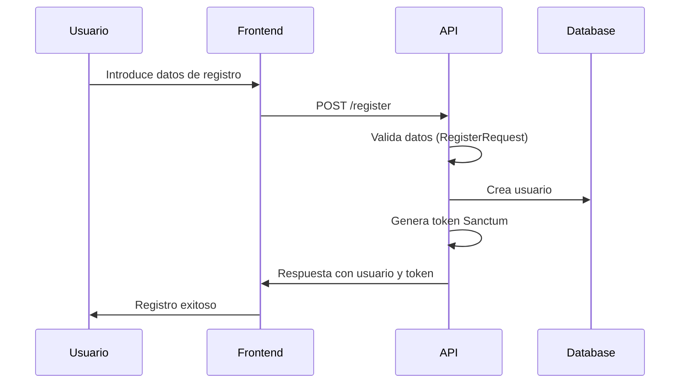
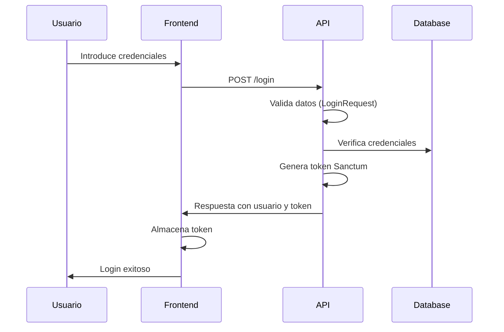
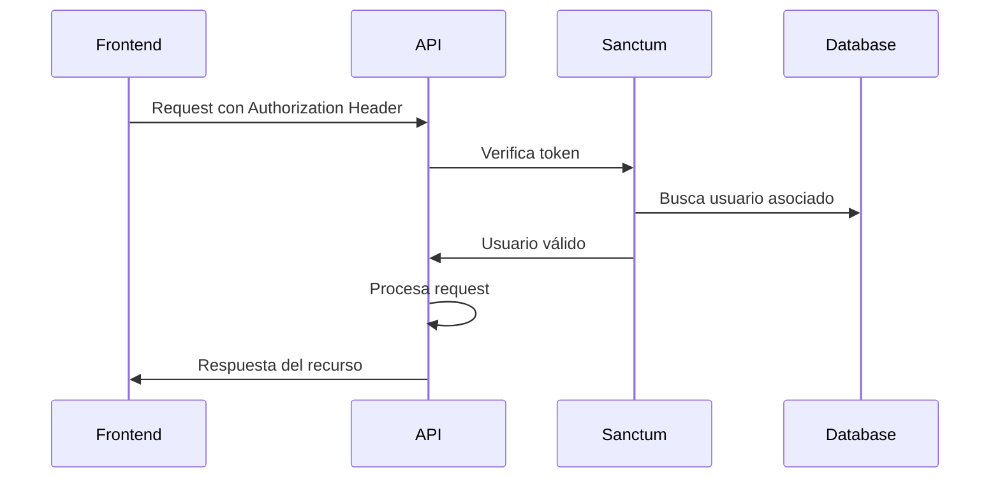

# Sistema de Autenticación - API RIMANAQ

## Tabla de Contenidos

1. [Descripción General](#descripción-general)
2. [Arquitectura](#arquitectura)
3. [Endpoints de Autenticación](#endpoints-de-autenticación)
4. [Modelos de Datos](#modelos-de-datos)
5. [Validaciones](#validaciones)
6. [Códigos de Respuesta](#códigos-de-respuesta)
7. [Ejemplos de Uso](#ejemplos-de-uso)
8. [Casos de Uso](#casos-de-uso)
9. [Manejo de Errores](#manejo-de-errores)
10. [Guías de Implementación](#guías-de-implementación)

---

## Descripción General

El sistema de autenticación de la API RIMANAQ utiliza **Laravel Sanctum** para proporcionar autenticación basada en tokens API. Este sistema permite el registro de usuarios, inicio de sesión, y gestión de sesiones de manera segura.

### Características Principales
- ✅ Registro de nuevos usuarios
- ✅ Inicio de sesión con email y contraseña
- ✅ Autenticación basada en tokens (Laravel Sanctum)
- ✅ Cierre de sesión seguro
- ✅ Validación robusta de datos
- ✅ Manejo de errores detallado
- ✅ Protección CSRF
- ✅ Hash seguro de contraseñas

---

## Arquitectura

```
┌─────────────────┐    ┌──────────────────┐    ┌─────────────────┐
│   Frontend      │────│   API Routes     │────│  AuthController │
│   (Cliente)     │    │   (/api/v1)      │    │                 │
└─────────────────┘    └──────────────────┘    └─────────────────┘
                                │                        │
                                │                        │
                       ┌──────────────────┐    ┌─────────────────┐
                       │  Request Classes │    │  User Model     │
                       │  (Validación)    │    │  (Eloquent)     │
                       └──────────────────┘    └─────────────────┘
                                │                        │
                                │                        │
                       ┌──────────────────┐    ┌─────────────────┐
                       │  Laravel Sanctum │    │  MySQL Database │
                       │  (Tokens)        │    │  (Persistencia) │
                       └──────────────────┘    └─────────────────┘
```

---

## Endpoints de Autenticación

### Base URL
```
http://localhost:8000/api
```

### 1. Registro de Usuario

**Endpoint:** `POST /register`

**Descripción:** Registra un nuevo usuario en el sistema.

**Headers:**
```http
Content-Type: application/json
Accept: application/json
```

**Parámetros del Body:**
| Campo | Tipo | Requerido | Descripción |
|-------|------|-----------|-------------|
| `name` | string | Sí | Nombre completo del usuario (máx. 255 caracteres) |
| `email` | string | Sí | Correo electrónico único |
| `password` | string | Sí | Contraseña (mín. 8 caracteres) |
| `password_confirmation` | string | Sí | Confirmación de contraseña |

**Respuesta Exitosa (201):**
```json
{
    "message": "Usuario registrado exitosamente",
    "user": {
        "id": 1,
        "name": "Juan Pérez",
        "email": "juan@example.com",
        "email_verified_at": null,
        "created_at": "2025-10-02T10:30:00.000000Z",
        "updated_at": "2025-10-02T10:30:00.000000Z"
    },
    "token": "1|abcdef123456789..."
}
```

### 2. Inicio de Sesión

**Endpoint:** `POST /login`

**Descripción:** Autentica un usuario existente.

**Headers:**
```http
Content-Type: application/json
Accept: application/json
```

**Parámetros del Body:**
| Campo | Tipo | Requerido | Descripción |
|-------|------|-----------|-------------|
| `email` | string | Sí | Correo electrónico registrado |
| `password` | string | Sí | Contraseña del usuario |

**Respuesta Exitosa (200):**
```json
{
    "message": "Login exitoso",
    "user": {
        "id": 1,
        "name": "Juan Pérez",
        "email": "juan@example.com",
        "email_verified_at": null,
        "created_at": "2025-10-02T10:30:00.000000Z",
        "updated_at": "2025-10-02T10:30:00.000000Z"
    },
    "token": "2|xyz789abc456def..."
}
```

### 3. Cierre de Sesión

**Endpoint:** `POST /logout`

**Descripción:** Cierra la sesión actual y revoca todos los tokens del usuario.

**Headers:**
```http
Content-Type: application/json
Accept: application/json
Authorization: Bearer {token}
```

**Respuesta Exitosa (200):**
```json
{
    "message": "Sesión cerrada correctamente"
}
```

### 4. Obtener Usuario Autenticado

**Endpoint:** `GET /user`

**Descripción:** Obtiene la información del usuario autenticado.

**Headers:**
```http
Accept: application/json
Authorization: Bearer {token}
```

**Respuesta Exitosa (200):**
```json
{
    "id": 1,
    "name": "Juan Pérez",
    "email": "juan@example.com",
    "email_verified_at": null,
    "created_at": "2025-10-02T10:30:00.000000Z",
    "updated_at": "2025-10-02T10:30:00.000000Z"
}
```

---

## Modelos de Datos

### Modelo User

**Tabla:** `users`

| Campo | Tipo | Descripción |
|-------|------|-------------|
| `id` | bigint | Identificador único (autoincremental) |
| `name` | varchar(255) | Nombre completo del usuario |
| `email` | varchar(255) | Correo electrónico (único) |
| `email_verified_at` | timestamp | Fecha de verificación del email |
| `password` | varchar(255) | Contraseña hasheada |
| `remember_token` | varchar(100) | Token de recordar sesión |
| `created_at` | timestamp | Fecha de creación |
| `updated_at` | timestamp | Fecha de última actualización |

**Relaciones:**
- `hasMany(Progress::class)` - Un usuario puede tener múltiples registros de progreso

**Atributos Ocultos:**
- `password`
- `remember_token`

**Atributos Fillable:**
- `name`
- `email`
- `password`

---

## Validaciones

### Registro de Usuario (RegisterRequest)

| Campo | Reglas | Mensaje de Error |
|-------|--------|------------------|
| `name` | `required\|string\|max:255` | "El nombre es obligatorio." |
| `email` | `required\|string\|email\|max:255\|unique:users` | "El correo es obligatorio." / "Este correo ya está registrado." |
| `password` | `required\|string\|min:8\|confirmed` | "Las contraseñas no coinciden." |

### Inicio de Sesión (LoginRequest)

| Campo | Reglas | Mensaje de Error |
|-------|--------|------------------|
| `email` | `required\|email` | "El correo es obligatorio." / "Debes ingresar un correo válido." |
| `password` | `required\|string` | "La contraseña es obligatoria." |

---

## Códigos de Respuesta

### Respuestas Exitosas

| Código | Descripción | Endpoint |
|--------|-------------|----------|
| `200` | OK - Operación exitosa | LOGIN, LOGOUT, GET USER |
| `201` | Created - Usuario creado exitosamente | REGISTER |

### Respuestas de Error

| Código | Descripción | Posibles Causas |
|--------|-------------|-----------------|
| `400` | Bad Request | Datos malformados en el request |
| `401` | Unauthorized | Token inválido o credenciales incorrectas |
| `422` | Unprocessable Entity | Errores de validación |
| `500` | Internal Server Error | Error interno del servidor |

---

## Ejemplos de Uso

### Registro de Usuario

```bash
curl -X POST http://localhost:8000/api/register \
  -H "Content-Type: application/json" \
  -H "Accept: application/json" \
  -d '{
    "name": "María González",
    "email": "maria@example.com",
    "password": "mi_password_seguro",
    "password_confirmation": "mi_password_seguro"
  }'
```

### Inicio de Sesión

```bash
curl -X POST http://localhost:8000/api/login \
  -H "Content-Type: application/json" \
  -H "Accept: application/json" \
  -d '{
    "email": "maria@example.com",
    "password": "mi_password_seguro"
  }'
```

### Acceso a Recurso Protegido

```bash
curl -X GET http://localhost:8000/api/user \
  -H "Accept: application/json" \
  -H "Authorization: Bearer 1|abcdef123456789..."
```

### Cierre de Sesión

```bash
curl -X POST http://localhost:8000/api/logout \
  -H "Content-Type: application/json" \
  -H "Accept: application/json" \
  -H "Authorization: Bearer 1|abcdef123456789..."
```

---

## Casos de Uso

### 1. Flujo de Registro Completo



### 2. Flujo de Autenticación



### 3. Acceso a Recursos Protegidos



---

## Manejo de Errores

### Errores de Validación (422)

```json
{
    "message": "The given data was invalid.",
    "errors": {
        "email": [
            "Este correo ya está registrado."
        ],
        "password": [
            "Las contraseñas no coinciden."
        ]
    }
}
```

### Error de Autenticación (401)

```json
{
    "message": "Unauthenticated."
}
```

### Credenciales Inválidas (422)

```json
{
    "message": "The given data was invalid.",
    "errors": {
        "email": [
            "Las credenciales no son válidas."
        ]
    }
}
```

### Error del Servidor (500)

```json
{
    "message": "Error al registrar usuario",
    "error": "Descripción técnica del error"
}
```

---

## Guías de Implementación

### Para Frontend (JavaScript/Vue.js)

#### 1. Configuración de Axios

```javascript
// api.js
import axios from 'axios';

const api = axios.create({
    baseURL: 'http://localhost:8000/api',
    headers: {
        'Content-Type': 'application/json',
        'Accept': 'application/json'
    }
});

// Interceptor para incluir token automáticamente
api.interceptors.request.use(
    (config) => {
        const token = localStorage.getItem('auth_token');
        if (token) {
            config.headers.Authorization = `Bearer ${token}`;
        }
        return config;
    },
    (error) => Promise.reject(error)
);

// Interceptor para manejar respuestas
api.interceptors.response.use(
    (response) => response,
    (error) => {
        if (error.response?.status === 401) {
            localStorage.removeItem('auth_token');
            window.location.href = '/login';
        }
        return Promise.reject(error);
    }
);

export default api;
```

#### 2. Servicio de Autenticación

```javascript
// authService.js
import api from './api';

class AuthService {
    async register(userData) {
        try {
            const response = await api.post('/register', userData);
            const { token, user } = response.data;
            
            localStorage.setItem('auth_token', token);
            localStorage.setItem('user', JSON.stringify(user));
            
            return response.data;
        } catch (error) {
            throw this.handleError(error);
        }
    }

    async login(credentials) {
        try {
            const response = await api.post('/login', credentials);
            const { token, user } = response.data;
            
            localStorage.setItem('auth_token', token);
            localStorage.setItem('user', JSON.stringify(user));
            
            return response.data;
        } catch (error) {
            throw this.handleError(error);
        }
    }

    async logout() {
        try {
            await api.post('/logout');
        } catch (error) {
            console.error('Error durante logout:', error);
        } finally {
            localStorage.removeItem('auth_token');
            localStorage.removeItem('user');
        }
    }

    async getCurrentUser() {
        try {
            const response = await api.get('/user');
            return response.data;
        } catch (error) {
            throw this.handleError(error);
        }
    }

    isAuthenticated() {
        return !!localStorage.getItem('auth_token');
    }

    getUser() {
        const user = localStorage.getItem('user');
        return user ? JSON.parse(user) : null;
    }

    handleError(error) {
        if (error.response?.data?.errors) {
            // Errores de validación
            return {
                type: 'validation',
                errors: error.response.data.errors
            };
        } else if (error.response?.data?.message) {
            // Error general
            return {
                type: 'general',
                message: error.response.data.message
            };
        } else {
            // Error de red u otro
            return {
                type: 'network',
                message: 'Error de conexión. Inténtalo de nuevo.'
            };
        }
    }
}

export default new AuthService();
```

#### 3. Ejemplo de Componente de Login (Vue.js)

```vue
<template>
  <form @submit.prevent="handleLogin" class="login-form">
    <h2>Iniciar Sesión</h2>
    
    <div class="form-group">
      <label for="email">Correo Electrónico</label>
      <input
        id="email"
        v-model="form.email"
        type="email"
        required
        :class="{ 'error': errors.email }"
      />
      <span v-if="errors.email" class="error-message">
        {{ errors.email[0] }}
      </span>
    </div>

    <div class="form-group">
      <label for="password">Contraseña</label>
      <input
        id="password"
        v-model="form.password"
        type="password"
        required
        :class="{ 'error': errors.password }"
      />
      <span v-if="errors.password" class="error-message">
        {{ errors.password[0] }}
      </span>
    </div>

    <button type="submit" :disabled="loading">
      {{ loading ? 'Iniciando...' : 'Iniciar Sesión' }}
    </button>

    <div v-if="generalError" class="general-error">
      {{ generalError }}
    </div>
  </form>
</template>

<script>
import AuthService from '@/services/authService';

export default {
  name: 'LoginForm',
  data() {
    return {
      form: {
        email: '',
        password: ''
      },
      errors: {},
      generalError: '',
      loading: false
    };
  },
  methods: {
    async handleLogin() {
      this.loading = true;
      this.errors = {};
      this.generalError = '';

      try {
        const response = await AuthService.login(this.form);
        
        // Redireccionar después del login exitoso
        this.$router.push('/dashboard');
        
        // Mostrar mensaje de éxito
        this.$toast.success(response.message);
        
      } catch (error) {
        if (error.type === 'validation') {
          this.errors = error.errors;
        } else {
          this.generalError = error.message;
        }
      } finally {
        this.loading = false;
      }
    }
  }
};
</script>
```

### Para Backend (Laravel)

#### 1. Middleware Personalizado

```php
<?php
// app/Http/Middleware/EnsureTokenIsValid.php

namespace App\Http\Middleware;

use Closure;
use Illuminate\Http\Request;
use Laravel\Sanctum\PersonalAccessToken;

class EnsureTokenIsValid
{
    public function handle(Request $request, Closure $next)
    {
        $token = $request->bearerToken();

        if (!$token) {
            return response()->json([
                'message' => 'Token no proporcionado'
            ], 401);
        }

        $accessToken = PersonalAccessToken::findToken($token);

        if (!$accessToken || !$accessToken->tokenable) {
            return response()->json([
                'message' => 'Token inválido'
            ], 401);
        }

        // Verificar expiración personalizada (opcional)
        if ($this->isTokenExpired($accessToken)) {
            $accessToken->delete();
            return response()->json([
                'message' => 'Token expirado'
            ], 401);
        }

        return $next($request);
    }

    private function isTokenExpired($accessToken)
    {
        // Ejemplo: expirar tokens después de 24 horas
        $expirationTime = 24 * 60; // 24 horas en minutos
        return $accessToken->created_at->addMinutes($expirationTime)->isPast();
    }
}
```

#### 2. Rate Limiting

```php
// routes/api.php

use Illuminate\Support\Facades\RateLimiter;
use Illuminate\Cache\RateLimiting\Limit;
use Illuminate\Http\Request;

// Configurar rate limiting para autenticación
RateLimiter::for('auth', function (Request $request) {
    return Limit::perMinute(5)->by($request->ip());
});

// Aplicar rate limiting a rutas de auth
Route::middleware('throttle:auth')->group(function () {
    Route::post('/register', [AuthController::class, 'register']);
    Route::post('/login', [AuthController::class, 'login']);
});
```

#### 3. Eventos de Autenticación

```php
<?php
// app/Listeners/LogSuccessfulLogin.php

namespace App\Listeners;

use Illuminate\Auth\Events\Login;
use Illuminate\Support\Facades\Log;

class LogSuccessfulLogin
{
    public function handle(Login $event)
    {
        Log::info('Usuario logueado exitosamente', [
            'user_id' => $event->user->id,
            'email' => $event->user->email,
            'ip' => request()->ip(),
            'user_agent' => request()->userAgent(),
            'timestamp' => now()
        ]);
    }
}
```

### Mejores Prácticas de Seguridad

#### 1. Configuración de Sanctum

```php
// config/sanctum.php

return [
    'stateful' => explode(',', env('SANCTUM_STATEFUL_DOMAINS', sprintf(
        '%s%s',
        'localhost,localhost:3000,127.0.0.1,127.0.0.1:8000,::1',
        env('APP_URL') ? ','.parse_url(env('APP_URL'), PHP_URL_HOST) : ''
    ))),

    'expiration' => 60 * 24, // 24 horas

    'middleware' => [
        'verify_csrf_token' => App\Http\Middleware\VerifyCsrfToken::class,
        'encrypt_cookies' => App\Http\Middleware\EncryptCookies::class,
    ],
];
```

#### 2. Validaciones Adicionales

```php
<?php
// app/Http/Requests/Auth/RegisterRequest.php

public function rules(): array
{
    return [
        'name' => [
            'required',
            'string',
            'max:255',
            'regex:/^[a-zA-ZÀ-ÿ\s]+$/', // Solo letras y espacios
        ],
        'email' => [
            'required',
            'string',
            'email',
            'max:255',
            'unique:users',
            'regex:/^[a-zA-Z0-9._%+-]+@[a-zA-Z0-9.-]+\.[a-zA-Z]{2,}$/',
        ],
        'password' => [
            'required',
            'string',
            'min:8',
            'confirmed',
            'regex:/^(?=.*[a-z])(?=.*[A-Z])(?=.*\d)(?=.*[@$!%*?&])[A-Za-z\d@$!%*?&]/', // Al menos una mayúscula, minúscula, número y símbolo
        ],
    ];
}
```

---

## Conclusión

Este sistema de autenticación proporciona una base sólida y segura para la API RIMANAQ. La implementación utiliza las mejores prácticas de Laravel y Sanctum, garantizando la seguridad y escalabilidad del sistema.

### Próximos Pasos Sugeridos

1. **Implementar verificación de email**
2. **Agregar recuperación de contraseña**
3. **Implementar autenticación de dos factores (2FA)**
4. **Agregar roles y permisos**
5. **Implementar logging de actividades**
6. **Configurar políticas de contraseñas más estrictas**

---

**Versión:** 1.0  
**Última actualización:** 2 de Octubre, 2025  
**Autor:** Equipo de Desarrollo RIMANAQ